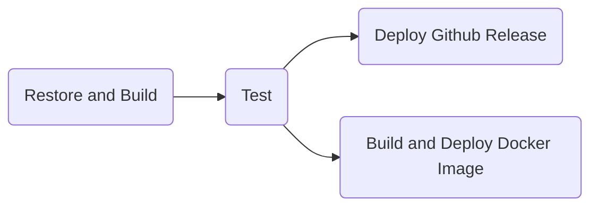

Sure, here's an example outline for your README file:

# Project-Plutus

## Overview

Welcome to Project-Plutus, an F# ASP.NET app that allows you to access the price and history of cryptocoins using the coingecko API, among other things. This project features Dapper repositories to access an SQL Server database, xUnit tests using Fluent Assertions and Moq, and a CI/CD pipeline using Azure DevOps pipelines.

## Features

### Cryptocoin Price and History

Project-Plutus includes a controller that allows you to access the price and history of various cryptocoins using the coingecko API. This feature allows you to easily track the performance of your favorite cryptocurrencies.

### Dapper Repositories

Dapper is a lightweight ORM that allows for fast database access. Project-Plutus includes Dapper repositories that simplify accessing an SQL Server database.

### Unit Testing with Fluent Assertions and Moq

Project-Plutus includes xUnit tests that use Fluent Assertions and Moq to ensure that the code is functioning correctly. These tests cover the most critical parts of the codebase.

### Legends and Users

The project features some mock NFTs available to buy and sell by users in PCoins.

## CI/CD Pipeline

Project-Plutus uses Azure DevOps pipelines for continuous integration and deployment. The pipeline is configured to buildthe app, run the tests, and deploy the app to a specified environment. The pipeline ensures that any changes made to the codebase are thoroughly tested and deployed to the environment in a reliable and repeatable manner.

The CI/CD pipeline for this project has several stages, as follows:

- **Restore and Build**: This stage restores the necessary dependencies and builds the solution using .NET Core SDK. If the build fails, the pipeline stops and reports an error.

- **Test**: This stage runs the xUnit tests using the dotnet test command. If any tests fail, the pipeline stops and reports an error.

- **Deploy Release and Docker Image**: If the tests pass, the pipeline splits into two stages.

    - **Deploy Release**: If the pipeline is triggered by a tag with the name "v1.*", this stage deploys a GitHub release. The release includes the app's binaries and a changelog, and is tagged with the same version number as the tag that triggered the pipeline.

    - **Build and Deploy Docker Image**: This stage builds a Docker image of the app using the Dockerfile in the project root. The image is then pushed to Docker Hub.



## Lore

Welcome to the world of Plutus, where brave warriors and powerful beasts roam the land. In this world, users can buy and sell legendary NFTs called Legends, each with their own unique attributes like weapons, armor, classes and pets. But beware, these Legends are not easily tamed - they must be trained in the Village by completing dangerous quests and challenging jobs.

The Legends in Plutus are generated using a powerful algorithm that selects from a vast array of available options, including Common, Rare, and Legendary attributes. Using a weighted random algorithm, each Legend is given a unique set of attributes that make it one-of-a-kind.

But the world of Plutus is not without its dangers. Users must be careful when buying and selling Legends in the market, as nefarious characters may try to scam or steal from unsuspecting buyers. It's up to the users to use their wits and cunning to navigate this treacherous market and emerge victorious.

So join us in the world of Plutus, and experience the thrill of buying, selling, and training your very own Legends. Are you brave enough to rise to the challenge and become a legendary hero in this fantastical world?

## Roadmap

Project-Plutus is an ongoing project, and there are several features and improvements planned for future releases. Some of the upcoming features include:

- Adding more functionality to the cryptocoins controller, such as the ability to add and remove coins from a watchlist.
- Implementing a caching layer to improve performance when accessing the coingecko API.
- Adding more tests to increase code coverage and ensure greater reliability.
- Refactoring the codebase to improve maintainability and readability.

## Getting Started

To get started with Project-Plutus, follow the instructions below:

1. Clone the repository to your local machine.
2. Install the necessary dependencies by running `dotnet restore`.
3. Create the database and then the tables using the following commands
    ```sql
    CREATE TABLE User (
      Name varchar(255),
      PCoin int,
      PRIMARY KEY (Name)
    );
    
    CREATE TABLE Legend (
      Id int IDENTITY(1,1),
      Name varchar(255),
      Armor varchar(255),
      Weapon varchar(255),
      Specialization varchar(255),
      Race varchar(255),
      Pet varchar(255),
      ExpLevel int,
      Owner varchar(255),
      ForSale bit,
      PRIMARY KEY (Id),
      FOREIGN KEY (Owner) REFERENCES User(Name)
    );
    ```
4. Change the connection string int the repositories to yours
5. Build the app by running `dotnet build`.
6. Run the tests by running `dotnet test`.
7. Launch the app by running `dotnet run`.

## Contributing

Contributions to Project-Plutus are always welcome. If you find a bug or have an idea for a new feature, please create an issue on the GitHub repository. If you would like to contribute code, please fork the repository and create a pull request with your changes.